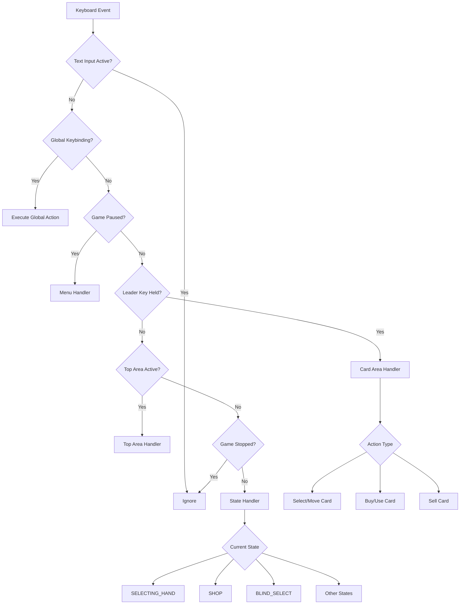

Typist is built with a modular architecture that intercepts keyboard events and routes them through state-specific handlers. This page explains how the mod is structured and how events flow through the system.

## Core Architecture

The mod follows a layered architecture with clear separation of concerns:

```
Entrypoint (key intercept)
    ↓
Global keybindings
    ↓
State handlers
    ↓
Card area handlers
    ↓
Layout system
```

### Entry Point

The main entry point (`mod/entrypoint.lua`) intercepts all keyboard events and routes them through a priority-based handler chain:

```lua
return function(Controller, key)
  -- Priority 1: Skip if text input is active
  if G.CONTROLLER and G.CONTROLLER.text_input_hook then
    -- do nothing
  
  -- Priority 2: Global keybindings (run info, options)
  elseif layout.global_map[key] then
    layout.global_map[key]()
  
  -- Priority 3: Paused menu handler
  elseif G.SETTINGS.paused then
    require("typist.mod.state-handlers")[G.STATES.MENU](key)
  
  -- Priority 4: Card area with leader key
  elseif cardarea_handler(area, key, held_keys) then
    -- handled by card area
  
  -- Priority 5: Top area (jokers + consumables)
  elseif top_area_handler(key) then
    -- handled by top area
  
  -- Priority 6: State-specific handlers
  elseif state_handlers[G.STATE] and G.GAME.STOP_USE == 0 then
    state_handlers[G.STATE](key, held_keys)
  end
end
```

<Note>
The priority order is crucial: text input blocks everything, global keys override states, and card areas take precedence over state handlers.
</Note>

## State Handlers

State handlers (`mod/state-handlers.lua`) implement game state-specific keyboard behavior. Each handler is a function that receives the pressed key and currently held keys:

```lua
state_handlers[G.STATES.SELECTING_HAND] = function(key, held_keys)
  -- Handle preview deck
  if held_keys[layout.preview_deck] then
    -- Show deck preview
  end
  
  -- Handle free selection
  elseif layout.free_select_map[key] then
    G.hand:__typist_toggle_card_by_index(layout.free_select_map[key])
  
  -- Handle play/discard
  elseif key == layout.proceed then
    G.FUNCS.play_cards_from_highlighted()
  end
end
```

### Supported Game States

Typist provides handlers for these game states:

<AccordionGroup>
  <Accordion title="SELECTING_HAND - Main gameplay">
    - Free selection by position (`a`, `s`, `d`, `f`, `g`, etc.)
    - Play hand (`space`) and discard (`tab`)
    - Invert selection, select left/right 5 cards
    - Sort by rank, suit, or enhancements
    - Cheat layer for best hand selection
    - Preview deck while holding preview key
  </Accordion>
  
  <Accordion title="SHOP - Shop interactions">
    - Reroll shop (`r`)
    - Buy cards (`c` in QWERTY)
    - Buy and use consumables (`v` in QWERTY)
    - Navigate shop items
    - Toggle back to blind select (`tab` or `enter`)
  </Accordion>
  
  <Accordion title="BLIND_SELECT - Choose blinds">
    - Select blind (`space` or `enter`)
    - Skip blind (`s`)
    - Reroll boss blind (`r`)
  </Accordion>
  
  <Accordion title="Standard/Planet/Spectral/Buffoon/Tarot Packs">
    - Select cards from booster pack
    - Skip booster (`tab`)
    - Multiple selection support in boosters
  </Accordion>
  
  <Accordion title="MENU - Main menu and overlays">
    - Start game from main menu (`space`)
    - Navigate deck selection
    - Handle game over screen
    - Integration with endless mode
  </Accordion>
  
  <Accordion title="ROUND_EVAL - Round evaluation">
    - Cash out (`space` or `enter`)
  </Accordion>
</AccordionGroup>

## Card Area Handlers

Card area handlers (`mod/cardarea-handler.lua`) provide unified keyboard control for any card collection (hand, jokers, consumables, shop, packs):

```lua
return function(area, key, held_keys)
  local target = layout.free_select_map[key]
  
  -- Select card if none selected
  if target and #area.highlighted == 0 then
    CardArea.__typist_toggle_card_by_index(area, target)
    return true
  end
  
  local c = area.highlighted[1]
  
  -- Sell card
  if key == layout.dismiss then
    if c:can_sell_card() then c:sell_card() end
  
  -- Use card
  elseif key == layout.proceed then
    G.FUNCS.use_card(e)
  
  -- Move card to target position
  elseif target then
    tu.list_move_item(area.cards, src_pos, target)
  end
  
  return true
end
```

### Pseudo-CardArea Objects

Typist creates virtual card areas to enable unified handling:

**Top Area** - Combines jokers and consumables:
```lua
G.__typist_TOP_AREA = setmetatable({}, { 
  __index = { __typist_top_area = true } 
})

-- Populated dynamically:
G.__typist_TOP_AREA.cards = tu.list_concat(
  G.jokers.cards, 
  G.consumeables.cards
)
```

**Shop Area** - Combines all shop items:
```lua
shop.cards = tu.list_concat(
  G.shop_jokers.cards,
  G.shop_vouchers.cards, 
  G.shop_booster.cards
)
```

### Special Features

**Unacorn Card** - Drag a card away from boss blind shuffling:
```lua
local function unacorn_card(card, held_keys)
  card.__typist_unacorned = true
  card.states.drag.is = true
  
  -- Event loop to keep card at top of screen
  Event {
    func = function()
      if held_keys[layout.unacorn_card] then
        card.T.y = 3  -- Keep at top
      else
        -- Release card
        card.__typist_unacorned = nil
        card.states.drag.is = false
      end
    end
  }
end
```

## Layout System

The layout system (`mod/layout.lua`) manages keyboard layouts and keybindings. It supports multiple layouts and runtime overrides:

### Layout Detection

```lua
local layout = love.filesystem.getInfo("typist-layout")
  and love.filesystem.read("typist-layout"):gsub("%s+", "")
  or "qwerty"  -- default
```

### Layout-Specific Keymaps

Each layout defines position-based keymaps:

```lua
free_select_map = ({
  qwerty = tu.enum {
    "a", "s", "d", "f", "g";
    "h", "j", "k", "l", ";";
    "y", "u", "i", "o", "p";
    "q", "w", "e", "r", "t";
  },
  dvorak = tu.enum {
    "a", "o", "e", "u", "i";
    "d", "h", "t", "n", "s";
    "f", "g", "c", "r", "l";
    "'", ",", ".", "p", "y";
  },
  -- ...
})[layout]
```

### Leader Keys

Leader keys provide modal keybinding layers:

```lua
cardarea_map = {
  [cardarea.HAND] = function() return G.hand end,
  [cardarea.JOKERS] = function() return G.jokers end,
  [cardarea.CONSUMEABLES] = function() return G.consumeables end,
}
```

Users hold a leader key (e.g., `/` for hand in QWERTY) then press position keys.

### Runtime Overrides

Users can create `typist-overrides.lua` to customize keybindings:

```lua
-- typist-overrides.lua
return function(layout)
  return {
    proceed = "e",  -- Change space to e
    dismiss = "q",  -- Change tab to q
    hand = {
      deselect_all = "x"  -- Change deselect key
    }
  }
end
```

The override function receives the current layout and returns a table that gets deep-merged with the base layout.

## Initialization Flow

<Steps>
  <Step title="Module initialization">
    `mod/init.lua` sets up global state and settings:
    ```lua
    G.SETTINGS.__typist = G.SETTINGS.__typist or {}
    G.SETTINGS.__typist.card_hover_duration = 10
    G.__typist_ORPHANED_UIBOXES = {}
    G.__typist_TOP_AREA = setmetatable({}, {...})
    ```
  </Step>
  
  <Step title="Compatibility layer loading">
    `compat/init.lua` initializes mod compatibility:
    ```lua
    require("typist.compat.fhotkey").init()
    require("typist.compat.debugplus").init()
    ```
  </Step>
  
  <Step title="Layout configuration">
    The layout system loads user preferences and overrides
  </Step>
  
  <Step title="Entry point registration">
    The entrypoint function is registered to intercept keyboard events
  </Step>
</Steps>

## Event Flow Diagram



## Best Practices

<CardGroup cols={2}>
  <Card title="Extend State Handlers" icon="code">
    Add new keybindings by extending state handlers for specific game states
  </Card>
  
  <Card title="Use Pseudo-CardAreas" icon="layer-group">
    Create virtual card areas to unify keyboard control across different UI elements
  </Card>
  
  <Card title="Respect Priority" icon="layer-plus">
    Follow the priority chain when adding new handlers to avoid conflicts
  </Card>
  
  <Card title="Test All Layouts" icon="keyboard">
    Ensure keybindings work across QWERTY, Dvorak, and Workman layouts
  </Card>
</CardGroup>

## See Also

- [Modules Reference](/technical/modules) - Public API documentation
- [Compatibility](/technical/compatibility) - Mod compatibility details
- [Configuration](/guide/configuration) - User configuration options